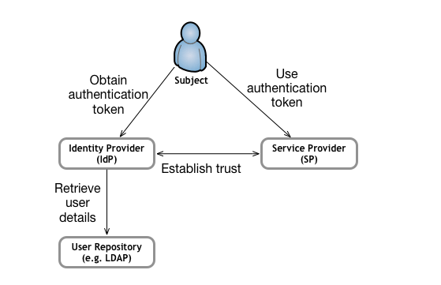
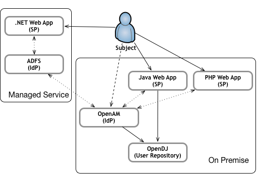
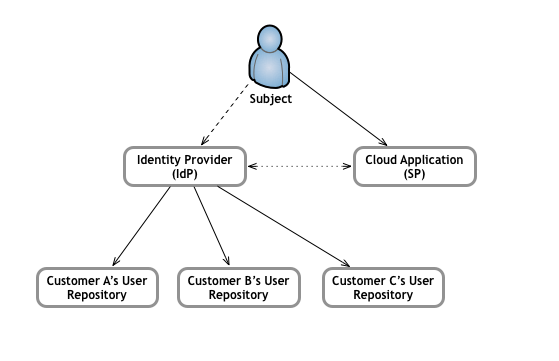

= SSO with Spring Security SAML
Brian Matthews <brian@btmatthews.com>
2016-03-31
:revealjs_theme: solarized

== What is SAML?

* Service Assertion Markup Language
** SAML 2.0 around since 2005
** Not backwards compatible with 1.x
* Service Providers (SP) / Relying Party
* Identity Provider (IdP) / Asserting Party

== What is SAML?

== Authentication vs Authorization

* SAML addresses on authentication via the IdP
* SAML does not specifically address authorization
** SP specific logic leverages attribute assertions

== Why SAML?

* Standards based
* Platform neutral
** Java, .NET, C/C++, Python, PERL, PHP
* Mix
** Bespoke applications
** Vendor solutions
** Managed services
* No vendor lock-in
* Open source implementations

== Building Blocks

* XML technologies
** XML schema
** XML digital signatures
** XML encryption
* Hypertext Transfer Protocol (HTTP)
* Simple Object Access Protocol (SOAP)

== Establish trust

* SPs and IdPs exchange metadata to establish trust
** Public keys for encryption and signing
** Service end-points for protocols and bindings
** Identifier and attribute formats
* Metadata should be signed using digital signatures

== Authentication

* Authentication happens at the IdP
* IdP initiated
** User accesses IdP to login
** Redirected to default URL for SP 
* SP initiated
** User accceses protected SP resource
** Redirected to IdP for login
** Redirected back to protected SP resource

== Identity & Attributes

* SAML assertion contains claims
* Identity can be many formats (e.g. e-mail or username)
* SP processes claims

== Use cases

* Profiles
** Single Sign-on
** Single Logout
* Enterprise Portal
* B2B Cloud Service

== Enterprise Portal

== B2B Cloud Service

== Identity Providers

* Examples
** OpenAM (ForgeRock) / OpenSSO (Oracle/Sun)
** Keycloak (Redhat)
** Shibboleth
** Okta
** Mircrosoft ADFS (2.0+)
* OAuth 2 support
* Social login

== Problems

* Attribute mappings
* Timetamps (need clocks synchornised)
* Load balancing (SAML exchange is state-ful)
* Certicates (hassle using unsigned certificates)

== !

Questions?

== Demo

* Spring Boot
* Spring Security SAML 2
* Keycloak
* MongoDB
* Docker
